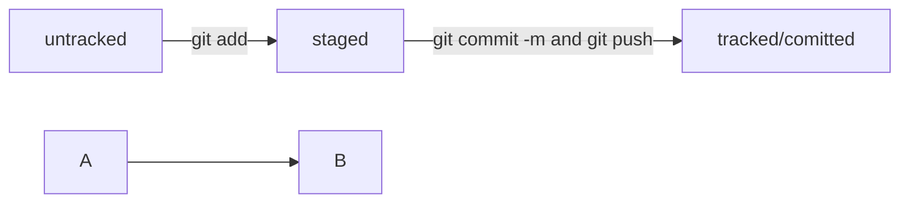

## Первый файл для проверки

Хочу проверить как будет выглядеть отображение в языке Си

```C

#include <stdio.h>

int main()
{
printf("Hello, Yandex");

return 0;
}
```

А так же как работает *курсив* и `code`.

Еще интересно как выглядит цитата:

>Хочу стать поступить в Школу 21 и стать специалистом за 1,5 года.



В файле HEAD хранится хеш последнего коммита, так же можно вместо хеша использовать указание на 
HEAD.
